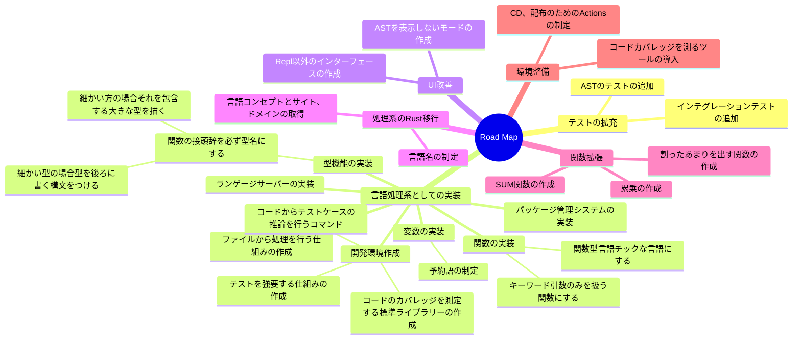

# csharp-shisoku
このリポジトリーは、オリジナルプログラミング言語を作っているリポジトリーです（？）

## How To Use

```terminal
$ dotnet run --project shisoku
option:
--file FileName :ファイル入力を受け付けます。
```

## Sample Program

ユークリッドの互除法を用いて、最大公約数を求めるプログラムの例です。

```
def calcGcd {|m,n |->
    switch n ?
        0 : {return m;},
        default:{ return calcGcd(m=n, n=(m % n));},;
};

return calcGcd(m=3355, n=2379);
```

## 開発者向け

開発中によく使うコマンドは [Taskfile.yml](./Taskfile.yml) で定義されています。
コマンド一覧は `task` コマンドを実行して確認してください。

## Road　Map


