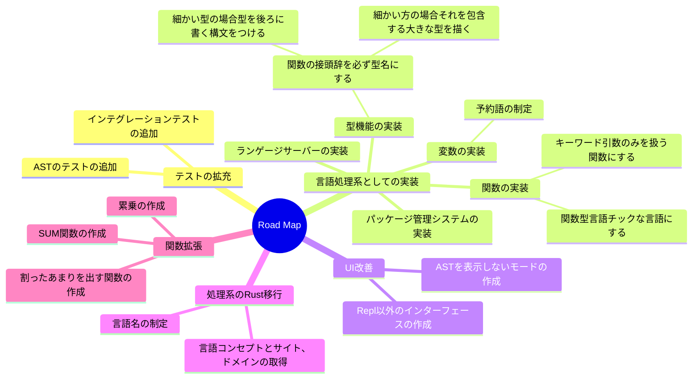

# csharp-shisoku
（）にも対応した四則演算を行うアプリケーションです。データ構造の学習を行うために以下の情報を出力します
- 結果の木構造
- 中間のASTのデータ構造
- 実際の計算結果

## How To Use

```terminal
$ dotnet run --project shisoku
```
以下のコマンドで対話形式で計算することができます。
使うことが可能な演算子は `+ - * / ()` です。

上記の演算子、数字以外を入力した場合はErrorを返します。

## Road　Map


